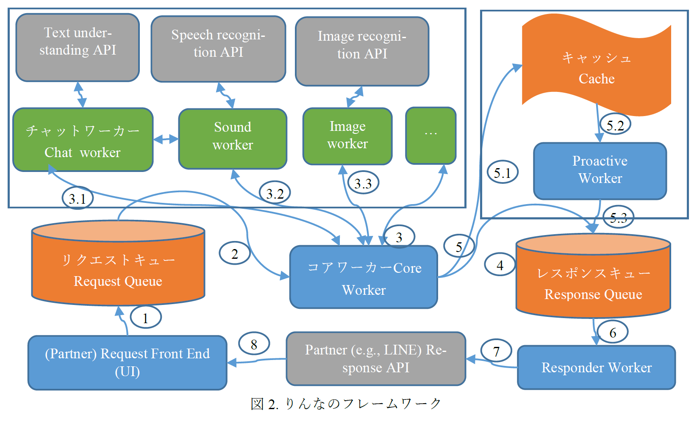

#　マイクロソフト社のりんな

マイクロソフト社のりんな構造を研究する。

> 4 チャットワーカー
> チャットワーカーはりんなの中心的なテキスト対話機能を実装している。インターネットから収集した対話ペアのデータを用いて訓練されたランキングや生成モデルがそれである。生成モデルは対話ペアのリクエストを源言語、レスポンスを目的言語と見なし、統計的機械翻訳のような枠組みで実装する。ランキングモデルは、既存の対話ペアのデータからユーザの新しいリクエストに最も類似する対話ペアを選び、そのレスポンスをユーザへ返す。リクエストとレスポンスの類似度を計算するランカーはブースティング決定木を用いて訓練される。なおそのランカーは下記の素性を使う：
> １． 翻訳モデル：リクエストとレスポンスの単語やフレーズ単位での対訳する確率p(r|q)とp(q|r)，そのうち、rはレスポンス、qはリクエスト。対話ペアデータにIBM モデル(Brown et al., 1993)を使ってアラインメントして、次にフレーズ対訳モデルを生成する。さらにGaoら(Gao et al., 2010) のフレーズランキングモデルを使って、ｑとｒの類似度を計算する。
> ２． 文の長さ：レスポンスの文字の数、単語の数、分節の数。
> ３． AIM (Huang et al., 2010)1言語モデル：対話ペアの現れた単語のベクターのcosine関数類似度。ウェブデータに基に、AIMソフトウェアを用いて、各単語に200次元のベクターを生成、さらに現れた単語のベクターの累加でqとrの文全体のベクターを生成する。
> ４． GRU類似度：対話ペアをクエリとドキュメントと見なし、情報検索につかうDSSMランキングモデル(Huang et al., 2013) でq/rペアの類似度を計算する。

資料：
[りんな：女子高生人工知能/言語処理学会 第22回年次大会 発表論文集 (2016年3月)](http://www.anlp.jp/proceedings/annual_meeting/2016/pdf_dir/B1-3.pdf)